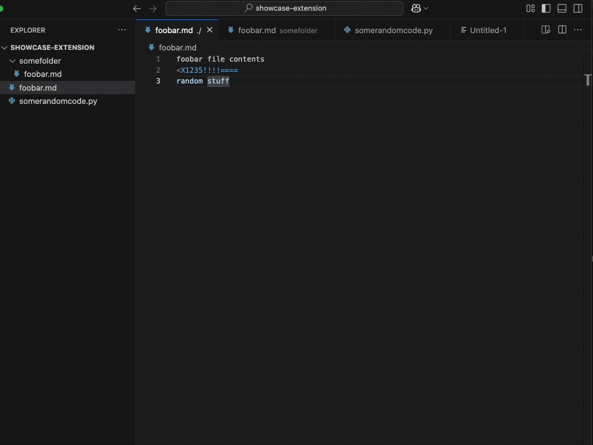

# Copy Active Files Tree

This extension provides two commands to copy information about open files in VSCode:

- **Copy tree of Active Files**: Copies a textual tree structure of the directories and files currently open in tabs.
- **Copy tree of Active Files Including Contents**: Copies an XML representation including the file tree and raw contents (from saved disk state).

## Usage
1. Open files in VSCode tabs (from any projects or locations).
2. Open the Command Palette (Ctrl+Shift+P or Cmd+Shift+P).
3. Run one of the commands.
4. Paste the clipboard contents wherever needed.

Note: Untitled files are ignored. Works with absolute paths and merges structures intelligently.

## Demo

## Details
This extension focuses on open tabs (visible editors) and builds a tree based on the following logic:

- **File Selection**: Only considers files open in tabs (via `window.tabGroups`), filtering for real filesystem files (scheme 'file'). Ignores untitled or virtual documents (e.g., Git diffs).
- **Tree Building**:
  - If VSCode is opened as a single workspace/folder, uses that folder as the tree root for files within it.
  - If no workspace or multiple workspaces, or files are outside any workspace: Finds the longest common prefix (common denominator) among the file paths as the root. If no common prefix, uses full paths with multiple roots.
  - Merges paths intelligently, showing directories only where needed (e.g., no empty folders).
- **Contents Handling**: For the "Including Contents" command, reads file contents directly from the filesystem (saved state on disk) using `workspace.fs.readFile`. Does not include unsaved changes in open editors—ensures consistency with what's persisted.
- **XML Output**: Wraps the tree in `<tree>`, followed by flat `<file path="...">` tags with raw contents (no escaping beyond minimal for XML validity; contents may break XML parsers if they contain invalid chars like unbalanced tags).
- **Edge Cases**: Handles cross-platform paths (normalizes to '/'), sorts entries alphabetically, and supports files from different drives/roots.

For more on development or contributions, see the source code.